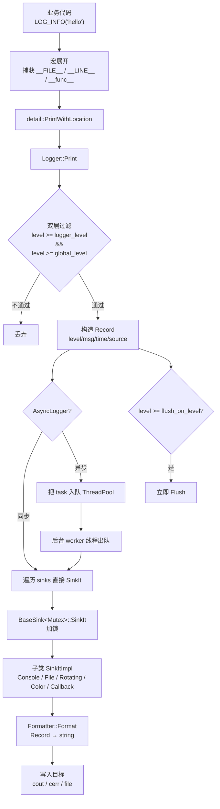
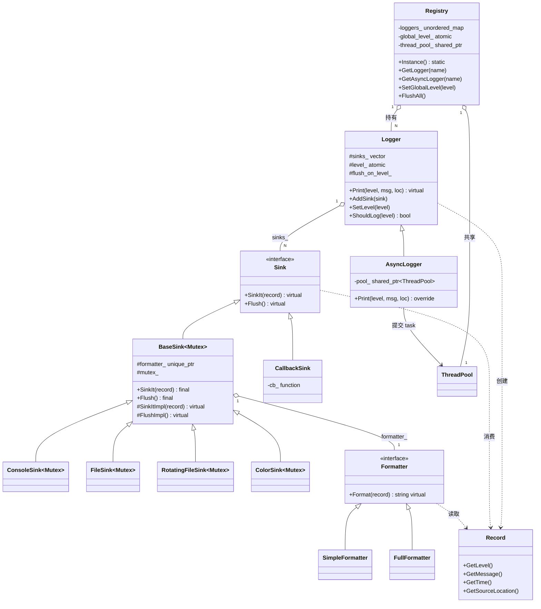
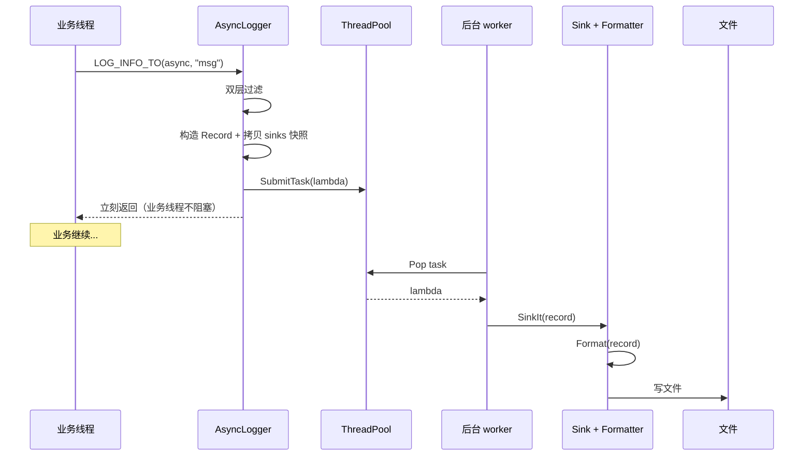

# TinyLogLibrary 架构

## 主调用链路

业务代码调用日志宏后，数据如何流转到最终输出。



**核心原则**：

- **Logger 管判断和分发**——双层过滤、构造 Record、遍历 sinks
- **Record 装数据**——纯结构化的日志事件
- **Sink 管"写到哪"**——文件、控制台、回调、网络...
- **Formatter 管"长什么样"**——拼字符串

格式化决策推迟到最后一公里（Sink 调 Formatter），中间所有层都只传结构化数据。

---

## 类关系



**关键关系**：

- `Sink` 是非模板纯接口——`Logger::sinks_` 用 `shared_ptr<Sink>` 装混合锁版本
- `BaseSink<Mutex>` 是模板——锁通过模板参数静态绑定，单线程版（NullMutex）零开销
- `CallbackSink` 直接继承 `Sink` 跳过 `BaseSink`——回调不需要 Formatter 也不需要库层加锁
- `AsyncLogger` 继承 `Logger` 只 override `Print`——其它方法（AddSink/SetLevel）共用基类实现

---

## ST/MT 别名体系

```
ConsoleSinkST = ConsoleSink<NullMutex>      ← 单线程零开销
ConsoleSinkMT = ConsoleSink<std::mutex>     ← 多线程加锁
FileSinkST    = FileSink<NullMutex>
FileSinkMT    = FileSink<std::mutex>
RotatingFileSinkST/MT
ColorSinkST/MT
```

`NullMutex::lock()/unlock()` 是空函数，编译器内联后整个 `lock_guard` 被消除——**单线程版没有任何运行时锁开销**。

---

## 异步日志的数据流



**关键设计**：

- **业务线程只做"入队"**——不碰 IO，立即返回
- **Record 和 sinks 都按值捕获进 lambda**——AsyncLogger 析构后 task 仍能安全执行
- **Registry 析构时 ThreadPool::Shutdown()**——等队列消费完才关闭，避免日志丢失

---

## 文件结构

```
include/tiny_log/
├── Level.h               日志等级枚举
├── SourceLocation.h      源码位置（file/line/function）
├── Record.h              一条日志的数据包
├── Sink.h                Sink 纯接口
├── Sink.h (BaseSink)     模板基类，封装 Mutex + Formatter
├── ConsoleSink.h         控制台输出（cout / cerr）
├── FileSink.h            文件输出
├── RotatingFileSink.h    按大小滚动
├── ColorSink.h           ANSI 彩色控制台
├── CallbackSink.h        用户回调扩展点
├── Formatter.h           格式化器接口
├── SimpleFormatter.h     [Level] msg [loc]
├── FullFormatter.h       [time] [loc] [Level] msg
├── Logger.h              核心 Logger
├── AsyncLogger.h         异步 Logger（继承 Logger）
├── Logging.h             用户入口（宏 + free function）
└── detail/
    ├── NullMutex.h       零开销空锁
    ├── TimeUtils.h       time_point → string
    ├── Registry.h        全局 Logger 注册表
    └── ThreadPool.h      底层执行器（来自 TinyThreadPool��

src/
├── Logger.cpp
├── AsyncLogger.cpp
├── Registry.cpp
└── ThreadPool.cpp
```
